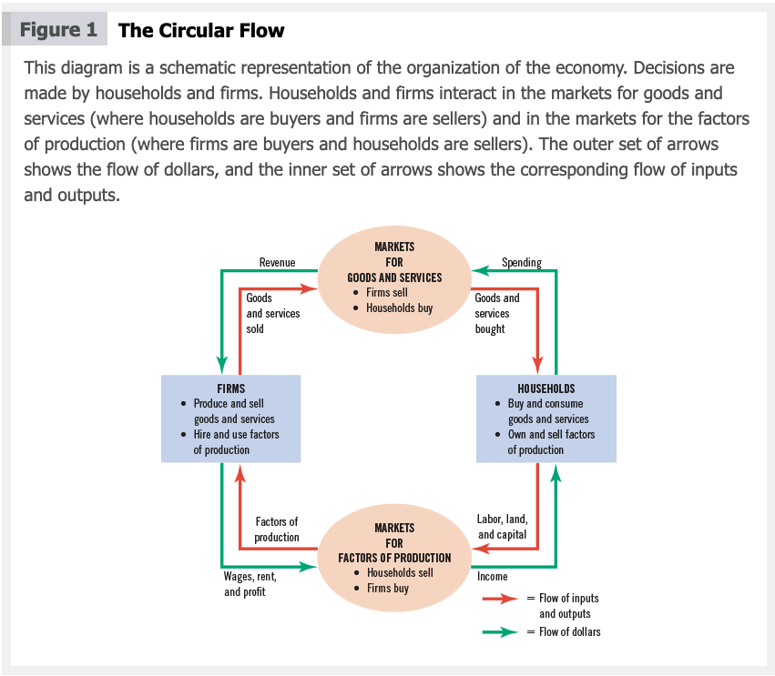
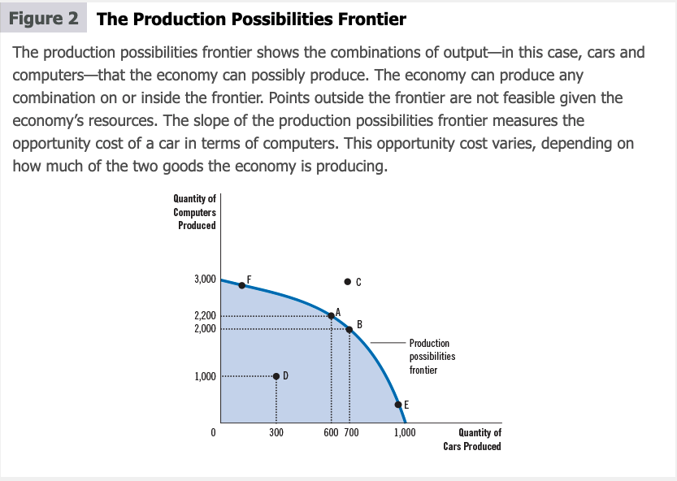
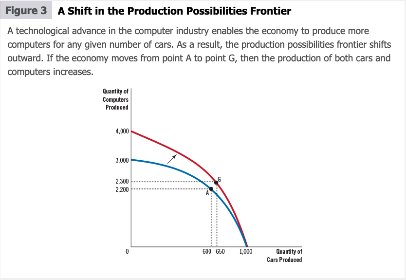

```{r setup, include=FALSE}
knitr::opts_chunk$set(echo = TRUE)
```

```{r, cache=FALSE, message=FALSE, warning=FALSE, include=FALSE}
## Load and install the packages that we'll be using today
if (!require("pacman")) install.packages("pacman")
pacman::p_load(tictoc, parallel, pbapply, future, future.apply, furrr, RhpcBLASctl, memoise, here, foreign, mfx, tidyverse, hrbrthemes, estimatr, ivreg, fixest, sandwich, lmtest, margins, vtable, broom, modelsummary, stargazer, fastDummies)
## My preferred ggplot2 plotting theme (optional)
theme_set(hrbrthemes::theme_ipsum())
```

# Introduction

Economics, like other sciences, has its own language. Economists deal and work with supply, demand, elasticity, ect. In this chapter, you will learn the language used in economics. This chapter will also allow you to use what we work on in economics to think and look at the world from the view point of an economist.

# The Economist as Scientist

Economist approach what they study in a subjective scientific manner. Just like a physicist or a chemist, economists introduce theories and hypotheses, collect and analyze data to reject or verify their theories. 

## The Scientific Method: Observation, Theory, and More Observations

As mentioned above, economists observe the worlds and devise theories. For example, an economist can observe that different countries experience different economic growth and could attribute that to the differences in institutions. North Korea does not have strong institutions, while South Korea does, which could explain why South Korea is richer that North Korea ^[This is based on Acemoglu, Johnson, and Robinson (2001), _The Colonial Origins of Comparative Development: An Empirical Investigation_]. Unlike other scientists, testing economic theory is hard. It is impractical, and in some cases impossible, to conduct experiments. 

## The Role of Assumptions

Economists make assumptions to simplify the complexity of the world and make some concept easier to understand. To study the choices of people, we can make the assumption that people make decisions rationally. Making the assumption of rational decision making simplifies the way we study decision making, even though it is false because the decision making process is complex.

# Economic Models

> “All models are wrong, but some are useful”. George E. P. Box

Economists use models to simplify how the world works and learn about it. Economic models consists of diagrams and equations. Economists use model to study economic issues, and you will encounter a few of them in this class and all of these models will have assumptions.

## The Circular-Flow Diagram

An economy consists of millions of people that buy, sell, work, hire, manufacture, etc. To understand the economy, however, we need to simplify it. The Circular-Flow Diagram model simplifies the economy to include two decision makers, firms and households. Firms provide goods and service using inputs like labor and capital.^[Think of a bank and a car factory. The bank provide banking services that allows people to deposit and withdraw money and buy goods using credit cards. The bank needs tellers and bankers (inputs) to be able to provide these services. A car manufacturer makes cars (goods) and to make car they will need steel, a land to build the factory on and wokrers (inputs).] The inputs are called the factors of production. Households own the factors of production---they work for the factories and could own them by buying stocks--- and consume all the goods and services.

In this model, firms and households interact with each other in two types of markets:

1. _Markets for goods goods and services_: household buy the goods (cars) and services (banking) and firms (banks and car manufacturers) sell these goods and services.
2. _Markets for the factors of production_: In this case, households are sellers and firms are buyers. People provide their time to work (sell) for income that a firm would pay (buy)


The outer loop of the diagram represents the flow of money/dollars. The inner loop represents the flows of inputs and outputs. For example, let us start by assuming the a person has money and they want to spend it on buying donuts from Shipley Do-Nuts. They go to the store, give the money in return for a donut---this is the market for goods and services. The money becomes revenue for Shipley Do-Nuts. The money the store just got will be paid on the factors of production. Shipley Do-Nuts needs to pay rent, buy ingredients to make donuts and hire people to make the donuts---this is the market for factors of production. The money the store spends will go back to households and so on...

## The Production Possibilities Frontier (PPF)

Most economic models are math intensive. In this section you will learn about one of the simplest models, the Production Possibilities Frontier (PPF). Assume the economy produces two goods. These goods are computers and cars. The PPP graph can tell us the many combination of cars and computers that the economy can produce given the available technology and inputs of production.



In figure 2, all the possible production combinations inside the frontier curve. Point D is a possible combination that leads to the production of 300 cars and 1,000 computers. Point D is an inefficient outcome because we can produce more. Points A, B, E and F are all possible combination that are efficient. The available technology and inputs do not allow this economy to produce at point C. 

The frontier curve can shift if an advancement in technology or an increase in the production inputs occurred. Figure 3 is an example of this. In this figure, the computer industry experienced a technological advancement. The economy is now able to produce more computer for any given numbers of cars. Point G that was not possible in the old economy, is now possible.



## Microeconomics and Macroeconomics

Many sciences have multiple fields and specialization. Economics is no different. Economics is studied at various levels. The field is divided into two subfields:

1. Microeconomics: is the study of how households and firms make decisions and how they interact in a market. A microeconomics studies the effect of college education on income, the effect of minimum wage on wellbeing and hours worked. 

2. Macroeconomics: is the study of an economy-wide phenomena. A macroeconomist studies the effect of the unemployment rate on inflation.

# The Economist as a Policy Adviser

## Positive versus Normative Analysis

1. Positive statements are claims about hoe the world _is_. Positive statements are descriptive.
2. Normative statements are claims about how the world _ought to be_. Normative statements are prescriptive. 


