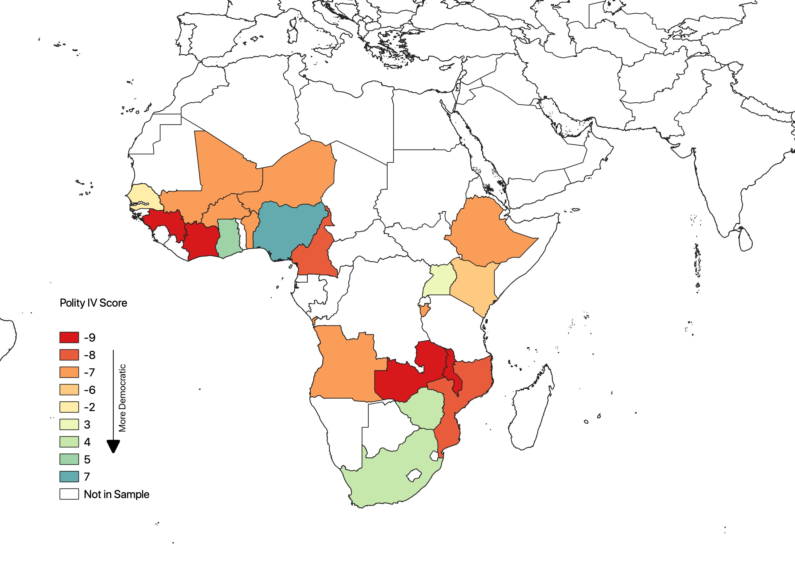
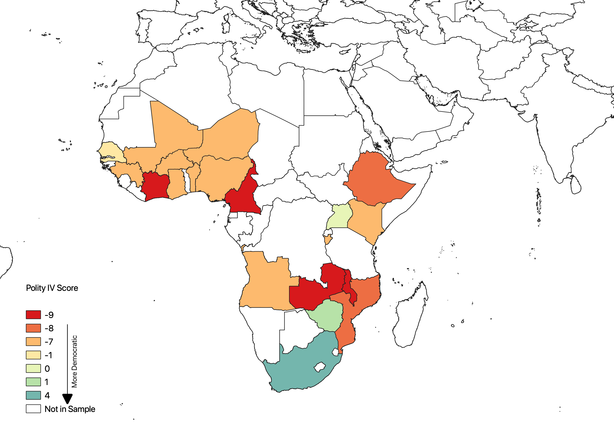
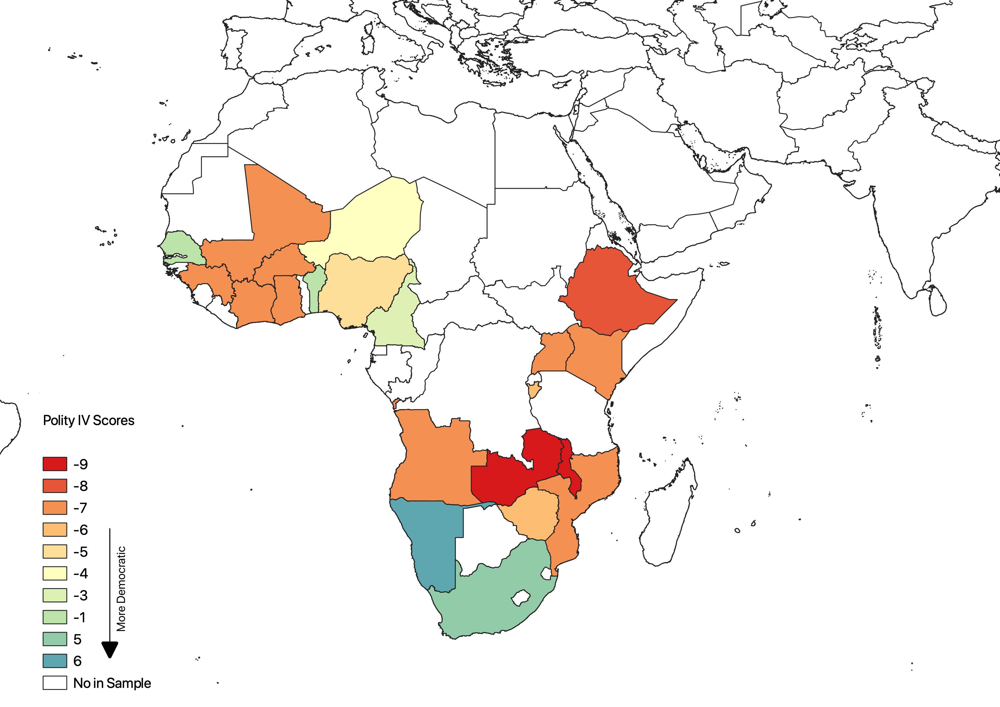
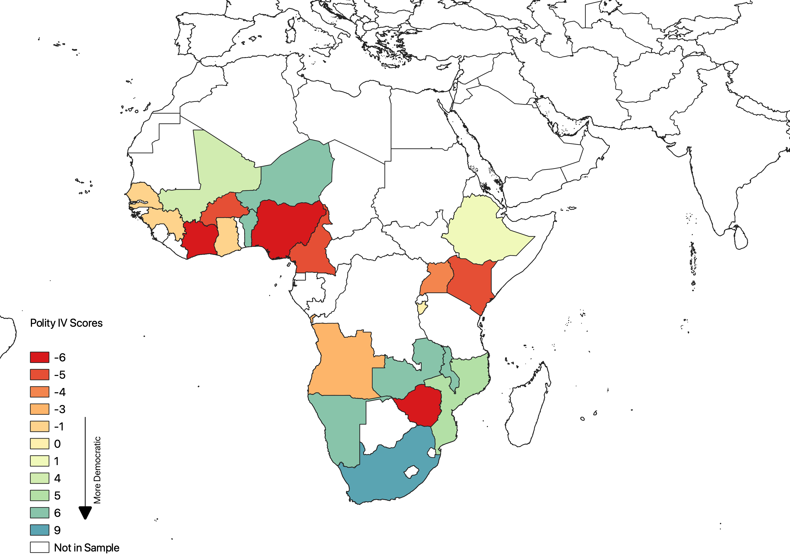
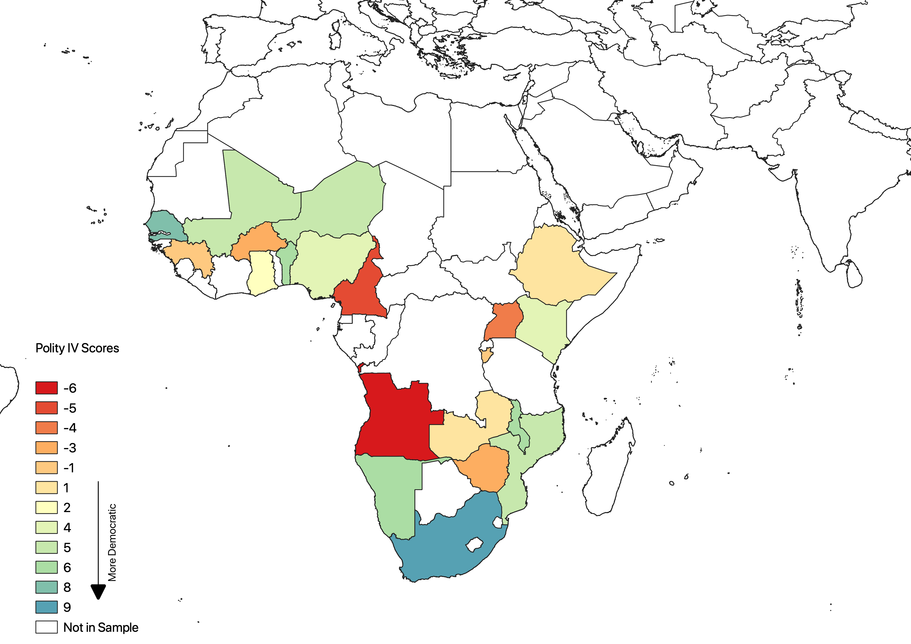
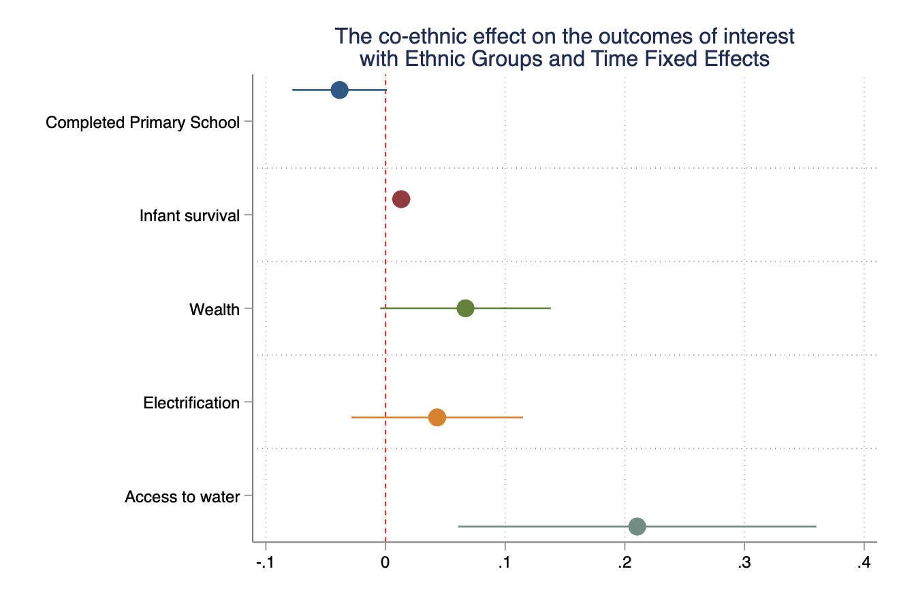
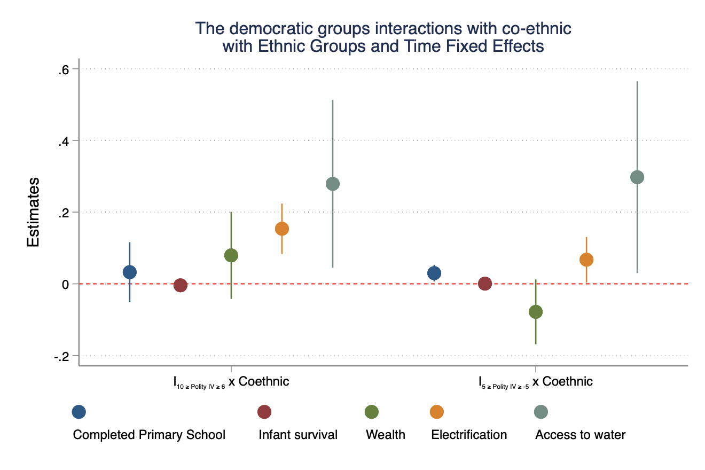

```{css, echo=FALSE}
# CSS for including pauses in printed PDF output (see bottom of lecture)
@media print {
  .has-continuation {
    display: block !important;
  }
}
```

```{r setup, include=FALSE}
options(htmltools.dir.version = FALSE)
library(knitr)
opts_chunk$set(
  fig.align="center",  
  fig.height=4, #fig.width=6,
  # out.width="748px", #out.length="520.75px",
  dpi=300, #fig.path='Figs/',
  cache=T#, echo=F, warning=F, message=F
  )
library(dagitty)
library(lavaan)
library(tidyverse)
library(dplyr)
library(fontawesome)
library(ggthemes)
library(ggplot2)
library(viridis)
library(hrbrthemes)
library(patchwork)
library(cowplot)
library(png)
```

# Table of contents

1. [Introduction](#intro)

2. [Data](#data)

3. [The Empirical Models](#empmodel)

4. [Results](#results)

5. [Conclusion](#conc)

6. [Appendix](#app)
---
class: inverse, center, middle
name: intro

# Introduction

<html><div style='float:left'></div><hr color='#EB811B' size=1px width=796px></html>

---
# Research Questions

<h2>
 <ul>
    <li>Does ethnic favoritism exist?</li>
  </ul>
</h2>

--
<h2>
 <ul>
    <li>Does a change in a country's political system (democracy to dictatorship and <em>vice versa</em>) affect ethnic favoritism?</li>
  </ul>
</h2>

--
#### Outcomes of Interest

<h5>For my analysis, I will use several outcomes:</h3>

<h5>
  <ol>
    <li>Primary school completion</li>
    <li>Infant survival</li>
    <li>Wealth</li>
    <li>Electrification</li>
    <li>Access to clean drinking water</li>
  </ol>
</h5>

---
# Motivation
<ul>
    <li style="font-size:25px; <!--font-weight: bold;-->"> <strong>Ethnic favoritism has been widespread in Africa and it negatively affects growth</strong> (La Porta et al., 1999; Alesina, Baqir and Easterly, 1999; Alesina et al., 2003; Alesina and Zhuravskaya, 2011)</li>
    <li style="font-size:25px; <!--font-weight: bold;-->"><strong>Ethnic diversity also affects the productivity of labor </strong>(Lazear, 1999; Habyarimana et al., 2007; Hjort, 2014)</li>
    <li style="font-size:25px; <!--font-weight: bold;-->"><strong>Investigating the effect of democracy on ethnic favoritism is important</strong></li>
    <li style="font-size:25px; <!--font-weight: bold;-->"><strong>According to the Congressional Research Service</strong> (Husted et al., 2020), <strong>the US provided more than $7.1 Billion in aid to Sub-Saharan Africa. Allocating these funds to countries that will distribute them equally among citizen could be of importance to policy makers</strong></li>
</ul>
---
# What is ethnic favoritism?

<h3>
  <ul>
  <li>Is the act in which the leader of a country would give preferential treatment to members of their own ethnic group</li>
  </ul>
</h3>

---
# Previewing the Results

<h3>
  <ul>
  <li>Ethnic favoritism:</li>
  </ul>
</h3>
<h4>
  <ol>
    <li>A co-ethnic mother's child is 1.3 percentage points more likely to sruvive the first year of birth</li>
    <li>A co-ethnic person is more likely to have access to clean drinking water</li>
    <li>A co-ethnic person is just as likely as a non-co-ethnic to finish primary school, have access to electricity and belong to the same wealth quintile</li>
  </ol>
</h4>

--
<h3>
  <ul>
  <li>Ethnic favoritism and democracy:</li>
  </ul>
</h3>
<h4>
  <ol>
      <li>A co-ethnic living in a democracy is 15.4 percentage points more likely to have electricity</li>
      <li>A co-ethnic living in an anocracy is 3 more likely to finish primary school and 6.7 percentage points more likely have electricity</li>
      <li>A co-ethnic living in democracies and anocracies has better access to clean drinking water</li>
      <li>Democracy does not significantly impede ethnic favoritsm</li>
  </ol>
</h4>

---
class: inverse, center, middle
name: data

# Data

<html><div style='float:left'></div><hr color='#EB811B' size=1px width=796px></html>

---
# Demographic and Health Surveys (DHS)

<h2>
    <ul>
    <li>DHS is a nationally representative survey conducted in 90 countries</li>
    </ul>
</h2>

--
<h2> 
    <ul> 
        <li>  Why DHS? </li>
         <ul>
         <h3>
            <li >It collects data on many outcomes I can use to measure favoritism</li>
            <li> Big sample size</li>
            <li> Collects data on ethnicity</li>
        </h3>
        </ul>
    </ul>
</h2>
  
---
# Polity IV as a Measure of Democracy

<h3>The Political Instability Task Force, a government-funded project, administers the measure. The index categorizes countries using five criteria:</h3>

<h3>
  <ol>
    <li>Elections for the executive are competitive</li>
    <li>Openness in running for office</li>
    <li>Regulation of political participation</li>
    <li>Competitive political participation</li>
    <li>Constraints on the executive branch</li>
  </ol>
</h3>

---
<h1 style="font-size:29px">Maps of Polity IV score in the countries I study from 1980 to 2000</h1>

<table>
  <tr>
    <td style="font-weight: bold;">1980</td>
    <td style="font-weight: bold;">1985</td>
    <td style="font-weight: bold;">1990</td>
  </tr>
  <tr>
    <td></td>
    <td></td>
    <td></td>
  </tr>
</table>
<table>
  <tr>
    <td style="font-weight: bold;">1995</td>
    <td style="font-weight: bold;">2000</td>
  </tr>
  <tr>
    <td></td>
    <td></td>
  </tr>
</table>

---
# Data on Leader's Ethnicity

<h2>
    <ul>
    <li> Fearon, Kasara and Laitin (2007a) collected data on the ethnicities of the world's heads of states from independence to 2007</li>
    </ul>
</h2>

</br>

<h2>
    <ul>
    <li>I supplemented the data to include more leaders and years</li>
    </ul>
</h2>

---

class: inverse, center, middle
name: empmodel

# The Empirical Models

<html><div style='float:left'></div><hr color='#EB811B' size=1px width=796px></html>

---
# Ethnic Favoritism

$$
\begin{align}
    Y_{iceta} &= \beta_{0} + \color{red}{\pmb{\beta_{1}}} coethnic_{iceta} + X_{iceta}^{\prime}+ \delta_{t} + \gamma_{ce} +\eta_{a}  + \varepsilon_{iceta}cn
\end{align}
$$
- $Y_{iceta}$ is the outcome of interest for person $i$ in country $c$ that belongs to the ethnic group $e$ at time $t$ and was of age $a$ at time of the survey
- $coethnic_{iceta} = \left\{\begin{array}{r l}1 & \text{if individual is co-ethnic}\\0 & \text{otherwise}\end{array}\right.$
- $X_{iceta}$ is a vector of controls
- $\delta_{t}$ is time fixed-effects
- $\gamma_{ce}$ is country specific ethnic fixed-effects
- $\eta_{a}$ is age fixed-effects

--
- $\color{red}{\pmb{\beta_{1}}}$ estimates the difference in outcomes between co-ethnics and non-co-ethnics

---
# Ethnic Favoritism and Democracy

$$
\begin{align}
    Y_{iceta} &= \beta_{0} + \beta_{1}coethnic_{iceta} + \beta_{2} I_{(k-1\leq Polity IV \leq k)} +\\
    &\sum_{k} \color{red}{\pmb{\beta_{k}}}coethnic_{iceta} \cdot I_{(k-1\leq Polity IV \leq k)} + X_{iceta}^{\prime}+ \delta_{t} + \gamma_{ce} +\eta_{a}  + \varepsilon_{iceta}
\end{align}
$$
- $Y_{iceta}$ is the outcome of interest for person $i$ in country $c$ that belongs to the ethnic group $e$ at time $t$ and was of age $a$ at time of the survey
- $coethnic_{iceta} = \left\{\begin{array}{r l}1 & \text{if individual is co-ethnic}\\0 & \text{otherwise}\end{array}\right.$
</br>

- $I_{(k-1\leq Polity IV \leq k)}= \left\{\begin{array}{r l}1 & \text{if } k-1\leq Polity IV \leq k\\0 & \text{otherwise}\end{array}\right.$
- $X_{iceta}$ is a vector of controls
- $\delta_{t}$ is time fixed-effects
- $\gamma_{ce}$ is country specific ethnic fixed-effects
- $\eta_{a}$ is age fixed-effects

--
- $\color{red}{\pmb{\beta_{k}}}$ estimates the difference in outcomes between co-ethnics and non-co-ethnics in democracies/anocracies and autocracies 

---
class: inverse, center, middle
name: results

# Results

<html><div style='float:left'></div><hr color='#EB811B' size=1px width=796px></html>

---
# The Existence of Ethnic Favoritism



---
# Ethnic Favoritism and Democracy


---
class: inverse, center, middle
name: conc

# Conclusion

<html><div style='float:left'></div><hr color='#EB811B' size=1px width=796px></html>

---
# Conclusion

<h3>
  <ul>
  <li>Ethnic favoritism:</li>
  </ul>
</h3>
<h4>
  <ol>
    <li>A co-ethnic mother's child is 1.3 percentage points more likely to sruvive the first year of birth</li>
    <li>A co-ethnic person is more likely to have access to clean drinking water</li>
    <li>A co-ethnic person is just as likely as a non-co-ethnic to finish primary school, have access to electricity and belong to the same wealth quintile</li>
  </ol>
</h4>

--
<h3>
  <ul>
  <li>Ethnic favoritism and democracy:</li>
  </ul>
</h3>
<h4>
  <ol>
      <li>A co-ethnic living in a democracy is 15.4 percentage points more likely to have electricity</li>
      <li>A co-ethnic living in an anocracy is 3 more likely to finish primary school and 6.7 percentage points more likely have electricity</li>
      <li>A co-ethnic living in democracies and anocracies has better access to clean drinking water</li>
      <li>Democracy does not significantly impede ethnic favoritism</li>
  </ol>
</h4>

---
class: inverse, center, middle
name: app

# Appendix

<html><div style='float:left'></div><hr color='#EB811B' size=1px width=796px></html>

---
# Constructing the Co-ethnicity Variable

<h3>For each outcome I used in my analysis, I constructed a co-ethnicity variable:
</h3>

<h4>
  <ol>
    <li>Primary school education: the portion of time spent under the rule of a co-ethnic leader between the ages of 6 and 13</li>
    <li>co-ethnicity is a dummy variable that equals 1 if the leader two years before a child's birth was co-ethnic with the mother</li>
    <li>Wealth: the portion of time spent under the rule of co-ethnic leader in the four years before the survey</li>
    <li>Electrification & Access to water: the portion of time spent under the rule of co-ethnic leader in the two years before the survey</li>
  </ol>
</h4>